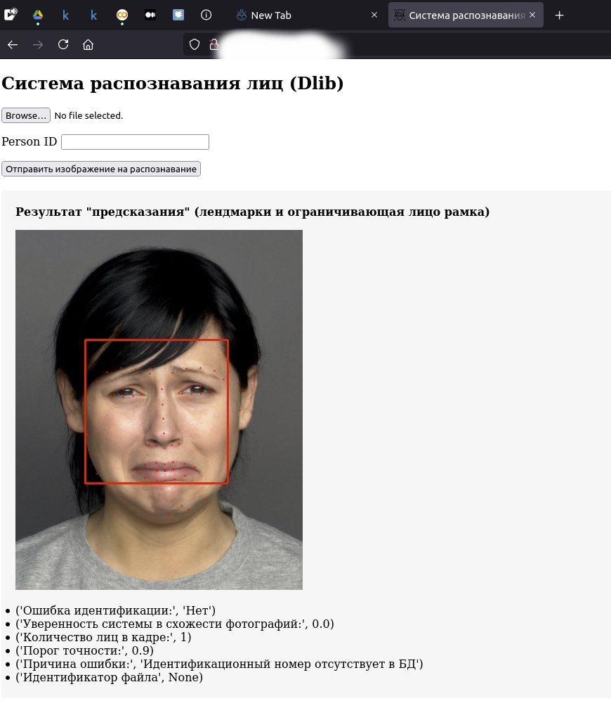
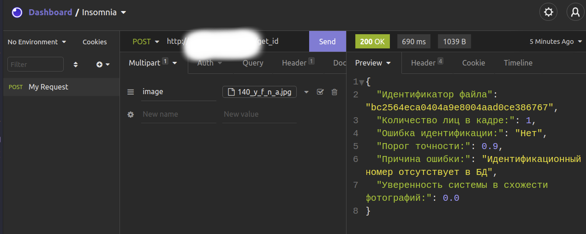

# Personnel-Faces-Identification

## Задание

Реализовать систему идентификации сотрудников по лицу при помощи общеизвестных библиотек (dlib, face-recognition, opencv, etc.)
Система должна быть реализована на языке python и представлять из себя веб-сервис, принимающий на вход:
- текущее фото сотрудника (например с веб-камеры);
- идентификационный номер сотрудника.

По идентификационному номеру, система осуществляет поиск эталонной фотографию в базе данных и проводит сравнение 
с заданным порогом точности. В качестве выходных параметров система должна предоставлять json с информацией о:
- наличии или отсутствии ошибки идентификации,
- при наличии ошибки, информировать о ее причинах; 
- уверенность системы в схожести фотографий;
- количество лиц в кадре;
- имя сотрудника;
- должность;
- идентификатор должности;
- порог точности.

Система должна обладать временем нечувствительности (5 секунд) к единичным ошибочным идентификациям. 
В качестве базы данных должна выступать директория с набором изображений.
Система должна сохранять фото успешной и неуспешной идентификаций в отдельную директорию, 
предоставляя идентификатор файла в ответе при запросе идентификации.

Варианты ошибок идентификации
- "другой человек в кадре";
- "больше одного лица в кадре";
- "нет лиц в кадре";
- "идентификационный номер отсутствует в БД";

## Легенда
- MAX_FACES - максимально допустимое одновременное количество лиц в кадре
- IM_HEIGHT - высота, до которой производится ресайз изображения
- LANDMARKS_COUNT - количество точек-лендмарок
- ACCURACY_THRESHOLD - трешхолд по степени уверенности 
- LANDMARKS_COLOR - цвет ограничивающего лицо прямоугольника
- faces_bboxes - обнаруженные на изображении рамки лиц
- image - rgb исходное изображение
- image_gray - исходное изображение в оттенках серого
- image_clone - копия исходного изображения
- authorized_staff_path - путь до изображений сотрудников (для формирования БД, единовременная необходимость)
- database - словарь с "базой данных" сотрудников 
- database_path - путь до базы данных сотрудников (authorized_staff_db.pickle)
- successful_recognitions_path - путь сохранения изображений сотрудников, которым успешно юыд предоставлен доступам
- unsuccessful_recognitions_path - путь сохранения изображений сотрудников, которым не был предоставлен доступ
- image_as_text - закодированное в текст изображение для отображения веб-формой
- identification_error_info - текущая ошибка идентификации
- all_identification_errors - перечень всех ошибок идентификации
- recognition_error - наличие или отсутствие ошибок идентификации
- recognition_confidence - степень уверенности в схожести лиц
- faces_count - количество лиц
- image_uuid - уникальный UUID для сохранения всех поступающих изображений

## Использование
1. Поставить все библиотеки из requirements.txt в виртуальное окружение, запустить app.py
```bash
mkdir Personnel-Faces-Identification && cd Personnel-Faces-Identification
python3 -m venv env
source env/bin/activate
pip install -r requirements.txt
python3 ./api/app.py
```
2. Запуск из докера:
```bash
docker-compose up -d
```
### Варианты использования решения:
 1. Через простой веб-интерфейс, загрузка файла и указание идентификационного номера сотрудника
   
#### 2. Посредством отправки post-запроса, для этого по адресу /get_id отправить файл изображения, 
   а также в header указать параметр person_id


## Task lists
- [ ] Добавить асинхронщину в выполнение функций предикта
- [ ] Сделать профайлинг функций
- [ ] Разбить файл face_recognition_service.py на функции, вынести в подмодуль
- [ ] Добавить базу данных PostgreSQL
- [ ] Вынести файлы моделей в git lfs
- [ ] Улучшить пользовательский интерфейс
- [ ] Рассмотреть другие модели, обучить свою модель детекции, распознавания лица (WiderFace или подобный датасет)
- [ ] Рефакторинг кода

## License
[MIT](https://choosealicense.com/licenses/mit/)